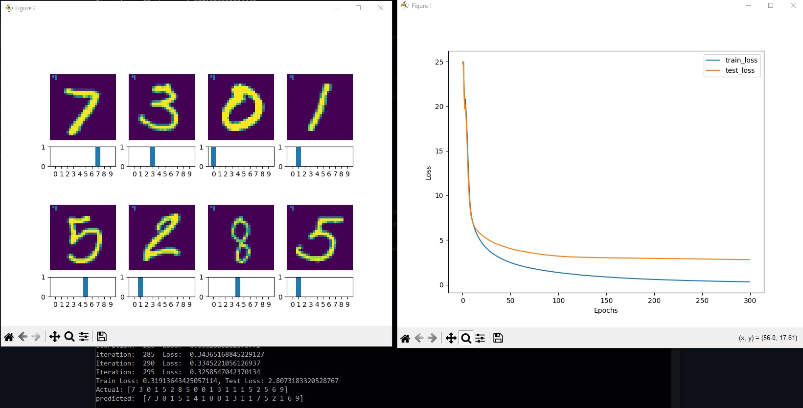
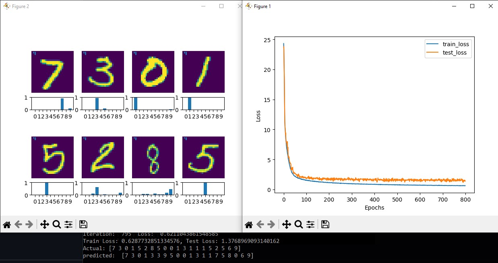
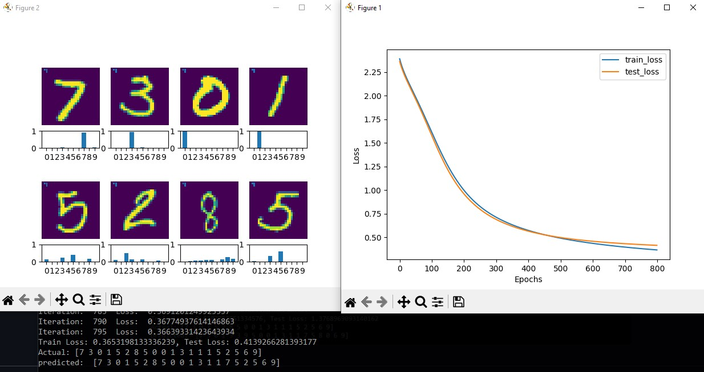

# MNIST Training


### Quick start

From `NN` directory run following command to install dependencies
```
pip install -e .
```

Then come back to `mnist` directory and run

```
python train.py --lr=0.01 --epochs=400
```

### Experiment

Train handwritten digit classification on feed forward neural network. What you can expect from running this script, you can see all the clear blocks or implementations of neuron(linear equation, activation), Dropout, softmax, loss function (BCE, CE)

```bash
python train.py --lr= --epochs= --dropout= --lambd=
```

Without dropout with following settings `python train.py --lr=0.001 --epochs=300` you can get following results.

`Train Loss` 0.31, `Test Loss` 2.80




Now with dropout with following settings `python train.py --lr=0.001 --epochs=800 --dropout=True` you can get following results.

`Train Loss` 0.62, `Test Loss` 1.37


Now finally, you normalize the input and train the model with same size witout dropout, with much higher learning rate then previous experiments you get good results.

 `python train.py --lr=0.01 --epochs=800`

`Train Loss` 0.365, `Test Loss` 0.41


