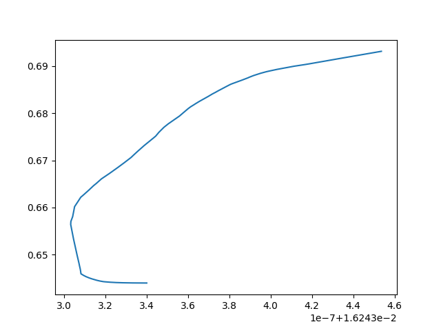
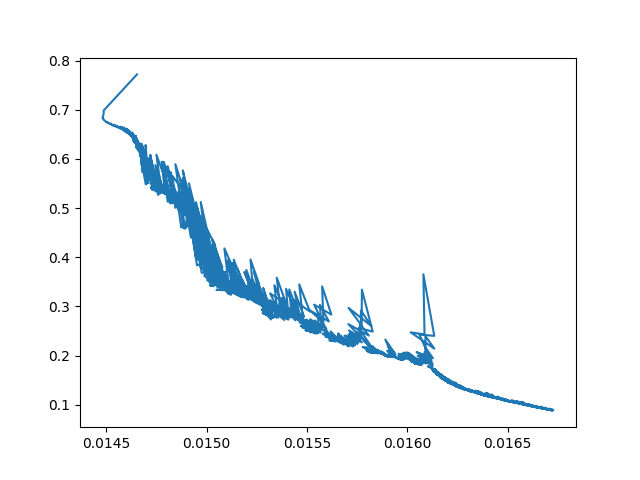

Tinynn is the script that implements the neural networks. As of it can work as a classifier. We can create N number of layers with N number of nodes with ReLU and Sigmoid activation function.

It has also a deferentiation for linear equation, ReLU, and Sigmoid activation functions.

## Initializing a network

> 💡 Note: Setting Rendom seed for comparing the results with exact values.

Problem: I wasn't able to train a nn and match the result with the Andrew Ng's.

Everything was correct, initializing network, forward pass, calculating cost, backward pass and updating parameters.

however as suggested in his course I multiplied the np.random.randn() \* 0.01 with 0.01 as shown. But it turns out that we have to divide it with the squar root of the no of input features like `np.random.randn(no_of_nodes, inputs) / np.sqrt(inputs)` and it worked!

Here is the picture where on X axis it is one of the weight of layer 1 and first node. and Y axis is the cost at perticular weight value.

As you can see from the image below when I initialized the network with `np.random.randn() * 0.01` it did not converged. And the last cost value was someware near 0.64 after 2500 iteration.

And when I initialized the same network same settings but with `np.random.randn(no_of_nodes, inputs) / np.sqrt(inputs)`, model convered and cost reached to its lowest 0.08 something after 2500 iterations.

**Takeaway:** Initializing a network is one of the important aspect of getting good results along with other like learning rate, no of iterations, layers, cost function, etc.

1. When I changed the parameter initialization to divide by sqrt it worked fine as compared to multiplying it with 0.01

else all the implementation was right.
